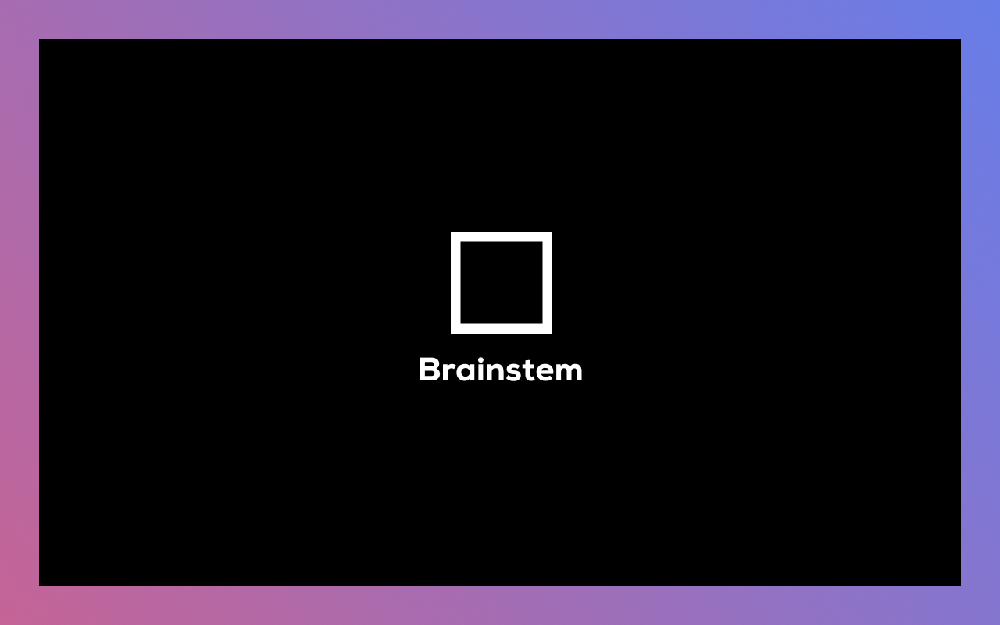

# Brainstem 🧠

> Your digital second brain for the web. Save links, text, and images with a single click.

Brainstem is a lightweight Chrome extension that helps you capture information from the web instantly. Whether it's an interesting article, a snippet of text, or an inspiring image, Brainstem saves it for you to access later.

## ✨ Features

- **🔗 Save Links**: Right-click any link to save it instantly.
- **📝 Save Text**: Highlight any text and save it along with the source URL.
- **🖼️ Save Images**: Right-click images to save them directly.
- **📋 One-Click Copy**: Copy saved content (text, URLs, or images) back to your clipboard.
- **📂 Organize**: Filter your saved items by type (Links, Text, Images).
- **🔒 Privacy First**: All data is stored locally in your browser. No external servers.

## 🚀 Installation

1. Clone or download this repository.
2. Open Chrome and navigate to `chrome://extensions/`.
3. Enable **Developer mode** in the top right corner.
4. Click **Load unpacked**.
5. Select the `brainstem` directory.

## 📖 Usage

### Saving Content
- **Links**: Right-click on a link and select **"Save Link to Brainstem"**.
- **Text**: Select text on any page, right-click, and choose **"Save Text to Brainstem"**.
- **Images**: Right-click on an image and select **"Save Image to Brainstem"**.

### Managing Brainstems
1. Click the **Brainstem icon** in your browser toolbar.
2. View all your saved items in the popup.
3. Use the tabs to filter by **All**, **Links**, **Text**, or **Images**.
4. Click the **Copy** icon to copy content to your clipboard.
5. Click the **Trash** icon to delete an item.

## 🛠️ Tech Stack

- **Manifest V3**: Built with the latest Chrome Extension standards.
- **Vanilla JavaScript**: Lightweight and fast.
- **CSS3**: Modern, responsive styling with a clean UI.
- **Chrome APIs**: Utilizes `storage`, `contextMenus`, and `clipboard` APIs.

## 📄 License

This project is licensed under the Unlicense.
